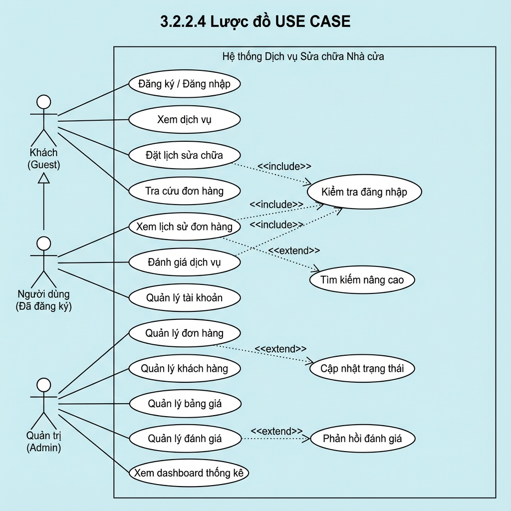

# 📊 Lược đồ USE CASE - Website Dịch Vụ Sửa Chữa Nhà Cửa

## 🎯 Tổng quan

Tài liệu này mô tả chi tiết sơ đồ Use Case cho hệ thống **Website Dịch Vụ Sửa Chữa Nhà Cửa - Trương Thanh Duy**, bao gồm các actor, use case và mối quan hệ giữa chúng.

---

## 👥 Các Actor (Tác nhân)

### 1. **Khách (Guest)** 🚶
- **Mô tả**: Người dùng chưa đăng ký hoặc chưa đăng nhập vào hệ thống
- **Quyền hạn**: 
  - Xem thông tin dịch vụ
  - Đăng ký tài khoản mới
  - Đăng nhập vào hệ thống
  - Đặt lịch sửa chữa (không cần đăng nhập)
  - Tra cứu đơn hàng bằng số điện thoại

### 2. **Người dùng (Đã đăng ký)** 👤
- **Mô tả**: Khách hàng đã đăng ký tài khoản và đăng nhập
- **Kế thừa từ**: Khách (Guest)
- **Quyền hạn bổ sung**:
  - Xem lịch sử đơn hàng của mình
  - Đánh giá dịch vụ sau khi hoàn thành
  - Quản lý thông tin tài khoản
  - Đổi mật khẩu

### 3. **Quản trị (Admin)** 👨‍💼
- **Mô tả**: Quản trị viên hệ thống
- **Quyền hạn**:
  - Quản lý tất cả đơn hàng
  - Quản lý khách hàng
  - Quản lý bảng giá dịch vụ
  - Quản lý đánh giá
  - Xem dashboard thống kê
  - Cập nhật trạng thái đơn hàng
  - Phản hồi đánh giá khách hàng

---

## 🔄 Các Use Case (Chức năng)

### 📌 Use Case cho Khách (Guest)

#### UC-01: Đăng ký / Đăng nhập
- **Mô tả**: Tạo tài khoản mới hoặc đăng nhập vào hệ thống
- **Actor**: Khách
- **Luồng chính**:
  1. Khách chọn "Đăng ký" hoặc "Đăng nhập"
  2. Điền thông tin (email, mật khẩu, họ tên, SĐT cho đăng ký)
  3. Hệ thống xác thực thông tin
  4. Tạo tài khoản/Đăng nhập thành công
- **Luồng thay thế**:
  - Email đã tồn tại → Thông báo lỗi
  - Sai mật khẩu → Thông báo lỗi

#### UC-02: Xem dịch vụ
- **Mô tả**: Xem danh sách các dịch vụ sửa chữa
- **Actor**: Khách
- **Luồng chính**:
  1. Truy cập trang chủ
  2. Xem danh sách dịch vụ (Điện, Nước, Sơn sửa, Chống thấm, Tổng hợp)
  3. Xem bảng giá dịch vụ cơ bản

#### UC-03: Đặt lịch sửa chữa
- **Mô tả**: Tạo đơn đặt lịch sửa chữa
- **Actor**: Khách
- **Include**: Kiểm tra đăng nhập (tùy chọn)
- **Luồng chính**:
  1. Chọn "Đặt lịch sửa chữa"
  2. Điền form: Họ tên, SĐT, Ngày hẹn, Địa chỉ, Loại dịch vụ, Mô tả
  3. Xem ước tính chi phí
  4. Xác nhận đặt lịch
  5. Nhận mã đơn hàng
- **Điều kiện tiên quyết**: Không bắt buộc đăng nhập
- **Điều kiện sau**: Đơn hàng được tạo với trạng thái "Mới"

#### UC-04: Tra cứu đơn hàng
- **Mô tả**: Tra cứu trạng thái đơn hàng bằng số điện thoại
- **Actor**: Khách
- **Luồng chính**:
  1. Chọn "Tra cứu đơn hàng"
  2. Nhập số điện thoại
  3. Xem danh sách đơn hàng và trạng thái
- **Luồng thay thế**:
  - Không tìm thấy đơn hàng → Thông báo

---

### 📌 Use Case cho Người dùng (Đã đăng ký)

#### UC-05: Xem lịch sử đơn hàng
- **Mô tả**: Xem tất cả đơn hàng đã đặt
- **Actor**: Người dùng
- **Include**: Kiểm tra đăng nhập
- **Extend**: Tìm kiếm nâng cao
- **Luồng chính**:
  1. Đăng nhập vào hệ thống
  2. Chọn "Lịch sử đơn hàng"
  3. Xem danh sách đơn hàng (tất cả trạng thái)
  4. Xem chi tiết từng đơn
- **Điều kiện tiên quyết**: Đã đăng nhập
- **Extend**: Có thể lọc theo trạng thái, ngày tạo

#### UC-06: Đánh giá dịch vụ
- **Mô tả**: Đánh giá chất lượng dịch vụ sau khi hoàn thành
- **Actor**: Người dùng
- **Include**: Kiểm tra đăng nhập
- **Luồng chính**:
  1. Vào lịch sử đơn hàng
  2. Chọn đơn đã hoàn thành
  3. Click "Đánh giá"
  4. Chọn số sao (1-5)
  5. Viết nhận xét
  6. Gửi đánh giá
- **Điều kiện tiên quyết**: 
  - Đã đăng nhập
  - Đơn hàng đã hoàn thành
  - Chưa đánh giá trước đó
- **Điều kiện sau**: Đánh giá được lưu và hiển thị công khai

#### UC-07: Quản lý tài khoản
- **Mô tả**: Xem và cập nhật thông tin cá nhân
- **Actor**: Người dùng
- **Include**: Kiểm tra đăng nhập
- **Luồng chính**:
  1. Chọn "Tài khoản"
  2. Xem thông tin hiện tại
  3. Cập nhật họ tên, số điện thoại
  4. Đổi mật khẩu (nếu cần)
  5. Lưu thay đổi
- **Điều kiện tiên quyết**: Đã đăng nhập

---

### 📌 Use Case cho Quản trị (Admin)

#### UC-08: Xem dashboard thống kê
- **Mô tả**: Xem tổng quan thống kê hệ thống
- **Actor**: Admin
- **Luồng chính**:
  1. Đăng nhập với quyền Admin
  2. Truy cập Dashboard
  3. Xem các chỉ số:
     - Tổng số đơn hàng
     - Đơn hàng mới
     - Đơn đang xử lý
     - Đơn đã hoàn thành
     - Doanh thu ước tính
- **Điều kiện tiên quyết**: Có quyền Admin

#### UC-09: Quản lý đơn hàng
- **Mô tả**: Xem và quản lý tất cả đơn đặt lịch
- **Actor**: Admin
- **Extend**: Cập nhật trạng thái
- **Luồng chính**:
  1. Vào "Quản lý đơn hàng"
  2. Xem danh sách tất cả đơn
  3. Chọn đơn cần xử lý
  4. Xem chi tiết đơn hàng
  5. Cập nhật trạng thái (Mới → Đã xác nhận → Đang xử lý → Hoàn thành/Hủy)
  6. Thêm ghi chú admin
  7. Lưu thay đổi
- **Điều kiện tiên quyết**: Có quyền Admin
- **Extend**: Có thể lọc theo trạng thái, ngày, loại dịch vụ

#### UC-10: Quản lý khách hàng
- **Mô tả**: Xem danh sách và thông tin khách hàng
- **Actor**: Admin
- **Luồng chính**:
  1. Vào "Quản lý khách hàng"
  2. Xem danh sách tất cả khách hàng
  3. Xem chi tiết từng khách hàng:
     - Thông tin cá nhân
     - Lịch sử đơn hàng
     - Tổng số đơn
     - Tổng chi tiêu
- **Điều kiện tiên quyết**: Có quyền Admin

#### UC-11: Quản lý bảng giá
- **Mô tả**: Cập nhật phí dịch vụ cơ bản
- **Actor**: Admin
- **Luồng chính**:
  1. Vào "Quản lý bảng giá"
  2. Xem phí hiện tại
  3. Nhập phí mới
  4. Lưu thay đổi
  5. Hệ thống ghi lại thời gian cập nhật
- **Điều kiện tiên quyết**: Có quyền Admin
- **Điều kiện sau**: Phí mới áp dụng cho các đơn hàng tiếp theo

#### UC-12: Quản lý đánh giá
- **Mô tả**: Xem và quản lý đánh giá của khách hàng
- **Actor**: Admin
- **Extend**: Phản hồi đánh giá
- **Luồng chính**:
  1. Vào "Quản lý đánh giá"
  2. Xem danh sách tất cả đánh giá
  3. Xem chi tiết từng đánh giá
  4. Phản hồi đánh giá (nếu cần)
  5. Ẩn/Hiện đánh giá công khai
- **Điều kiện tiên quyết**: Có quyền Admin
- **Extend**: Có thể lọc theo số sao, ngày tạo

---

## 🔗 Các mối quan hệ (Relationships)

### 1. **Kế thừa (Generalization)** ⬆️

```
Người dùng (Đã đăng ký) ──▷ Khách (Guest)
```

- **Ý nghĩa**: Người dùng đã đăng ký kế thừa tất cả quyền của Khách, đồng thời có thêm các quyền riêng
- **Quyền kế thừa**:
  - Xem dịch vụ
  - Đặt lịch sửa chữa
  - Tra cứu đơn hàng
  - Đăng nhập/Đăng ký

### 2. **Include (Bao gồm)** 📥

Mối quan hệ `<<include>>` biểu thị use case này **bắt buộc** phải thực hiện use case khác.

#### UC-13: Kiểm tra đăng nhập
- **Mô tả**: Xác thực người dùng đã đăng nhập
- **Được include bởi**:
  - Xem lịch sử đơn hàng
  - Đánh giá dịch vụ
  - Quản lý tài khoản

```
Xem lịch sử đơn hàng ──<<include>>──▷ Kiểm tra đăng nhập
Đánh giá dịch vụ ──<<include>>──▷ Kiểm tra đăng nhập
Quản lý tài khoản ──<<include>>──▷ Kiểm tra đăng nhập
```

### 3. **Extend (Mở rộng)** 📤

Mối quan hệ `<<extend>>` biểu thị use case **tùy chọn** có thể mở rộng use case gốc.

#### UC-14: Tìm kiếm nâng cao
- **Mô tả**: Lọc đơn hàng theo nhiều tiêu chí
- **Extend cho**: Xem lịch sử đơn hàng
- **Tiêu chí lọc**:
  - Trạng thái đơn hàng
  - Khoảng thời gian
  - Loại dịch vụ

```
Tìm kiếm nâng cao ──<<extend>>──▷ Xem lịch sử đơn hàng
```

#### UC-15: Cập nhật trạng thái
- **Mô tả**: Thay đổi trạng thái đơn hàng
- **Extend cho**: Quản lý đơn hàng
- **Các trạng thái**:
  - Mới
  - Đã xác nhận
  - Đang xử lý
  - Hoàn thành
  - Hủy

```
Cập nhật trạng thái ──<<extend>>──▷ Quản lý đơn hàng
```

#### UC-16: Phản hồi đánh giá
- **Mô tả**: Admin trả lời đánh giá của khách hàng
- **Extend cho**: Quản lý đánh giá
- **Luồng**:
  1. Chọn đánh giá cần phản hồi
  2. Viết nội dung phản hồi
  3. Lưu phản hồi
  4. Ghi lại thời gian phản hồi

```
Phản hồi đánh giá ──<<extend>>──▷ Quản lý đánh giá
```

---

## 📊 Sơ đồ Use Case



---

## 📋 Bảng tổng hợp Use Case

| ID | Tên Use Case | Actor | Độ ưu tiên | Include | Extend |
|----|--------------|-------|------------|---------|--------|
| UC-01 | Đăng ký / Đăng nhập | Khách | Cao | - | - |
| UC-02 | Xem dịch vụ | Khách | Trung bình | - | - |
| UC-03 | Đặt lịch sửa chữa | Khách | Cao | - | - |
| UC-04 | Tra cứu đơn hàng | Khách | Trung bình | - | - |
| UC-05 | Xem lịch sử đơn hàng | Người dùng | Cao | UC-13 | UC-14 |
| UC-06 | Đánh giá dịch vụ | Người dùng | Cao | UC-13 | - |
| UC-07 | Quản lý tài khoản | Người dùng | Trung bình | UC-13 | - |
| UC-08 | Xem dashboard thống kê | Admin | Cao | - | - |
| UC-09 | Quản lý đơn hàng | Admin | Cao | - | UC-15 |
| UC-10 | Quản lý khách hàng | Admin | Trung bình | - | - |
| UC-11 | Quản lý bảng giá | Admin | Thấp | - | - |
| UC-12 | Quản lý đánh giá | Admin | Trung bình | - | UC-16 |
| UC-13 | Kiểm tra đăng nhập | Hệ thống | Cao | - | - |
| UC-14 | Tìm kiếm nâng cao | Hệ thống | Thấp | - | - |
| UC-15 | Cập nhật trạng thái | Hệ thống | Cao | - | - |
| UC-16 | Phản hồi đánh giá | Hệ thống | Trung bình | - | - |

---

## 🎯 Luồng nghiệp vụ chính

### Luồng 1: Khách hàng đặt lịch và đánh giá

```
1. Khách truy cập website
   ↓
2. Xem dịch vụ (UC-02)
   ↓
3. Đặt lịch sửa chữa (UC-03)
   ↓
4. Nhận mã đơn hàng
   ↓
5. [Tùy chọn] Đăng ký tài khoản (UC-01)
   ↓
6. Admin xử lý đơn (UC-09 + UC-15)
   ↓
7. Hoàn thành dịch vụ
   ↓
8. Khách hàng đánh giá (UC-06 + UC-13)
```

### Luồng 2: Admin quản lý hệ thống

```
1. Admin đăng nhập
   ↓
2. Xem dashboard (UC-08)
   ↓
3. Quản lý đơn hàng mới (UC-09)
   ↓
4. Cập nhật trạng thái (UC-15)
   ↓
5. Quản lý đánh giá (UC-12)
   ↓
6. [Tùy chọn] Phản hồi đánh giá (UC-16)
```

---

## 🔐 Ma trận phân quyền

| Use Case | Khách | Người dùng | Admin |
|----------|-------|------------|-------|
| Đăng ký / Đăng nhập | ✅ | ✅ | ✅ |
| Xem dịch vụ | ✅ | ✅ | ✅ |
| Đặt lịch sửa chữa | ✅ | ✅ | ✅ |
| Tra cứu đơn hàng | ✅ | ✅ | ✅ |
| Xem lịch sử đơn hàng | ❌ | ✅ | ✅ |
| Đánh giá dịch vụ | ❌ | ✅ | ✅ |
| Quản lý tài khoản | ❌ | ✅ | ✅ |
| Xem dashboard thống kê | ❌ | ❌ | ✅ |
| Quản lý đơn hàng | ❌ | ❌ | ✅ |
| Quản lý khách hàng | ❌ | ❌ | ✅ |
| Quản lý bảng giá | ❌ | ❌ | ✅ |
| Quản lý đánh giá | ❌ | ❌ | ✅ |

---

## 📝 Ghi chú

### Quy ước ký hiệu
- **Hình chữ nhật**: Actor (tác nhân)
- **Hình oval**: Use Case (chức năng)
- **Đường liền**: Liên kết giữa Actor và Use Case
- **Đường đứt nét + <<include>>**: Quan hệ bao gồm (bắt buộc)
- **Đường đứt nét + <<extend>>**: Quan hệ mở rộng (tùy chọn)
- **Mũi tên rỗng**: Quan hệ kế thừa

### Lưu ý triển khai
1. **Kiểm tra đăng nhập** được implement bằng `[Authorize]` attribute trong ASP.NET Core
2. **Phân quyền** được quản lý bởi ASP.NET Core Identity với 3 roles: Admin, Staff, Customer
3. **Trạng thái đơn hàng** được lưu dưới dạng enum hoặc string trong database
4. **Đánh giá** chỉ cho phép tạo khi đơn hàng ở trạng thái "Hoàn thành"

---

## 📞 Thông tin dự án

**Sinh viên**: Trương Thanh Duy  
**Lớp**: DK24TTC2  
**Môn học**: Phát triển ứng dụng web với ASP.NET Core  
**Ngày tạo**: 25/11/2025  
**Phiên bản**: v2.0.0

---

**© 2025 - Website Dịch Vụ Sửa Chữa Nhà Cửa - Trương Thanh Duy**
